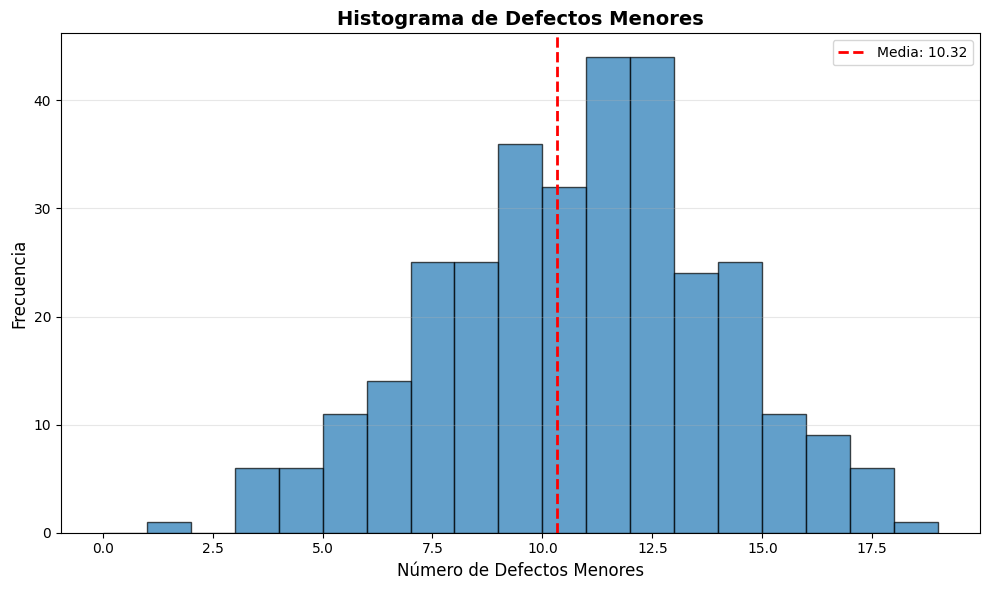
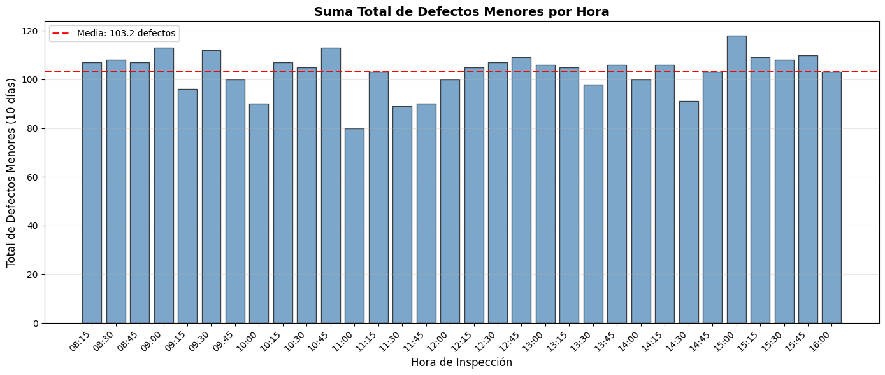
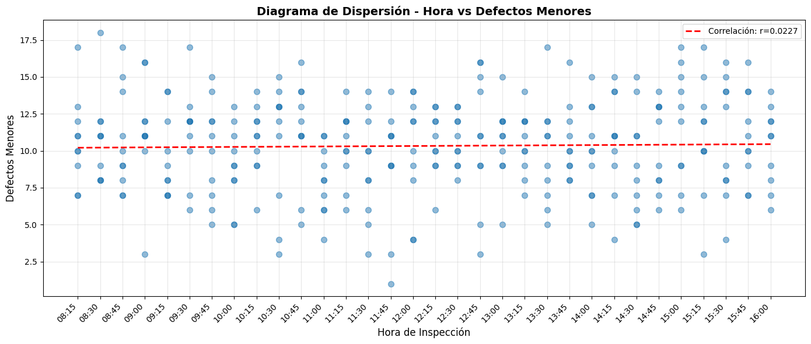
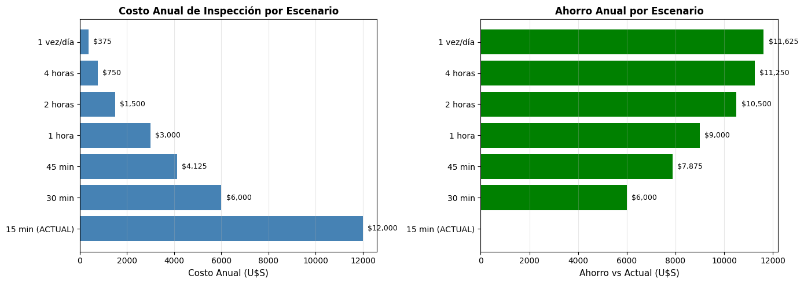
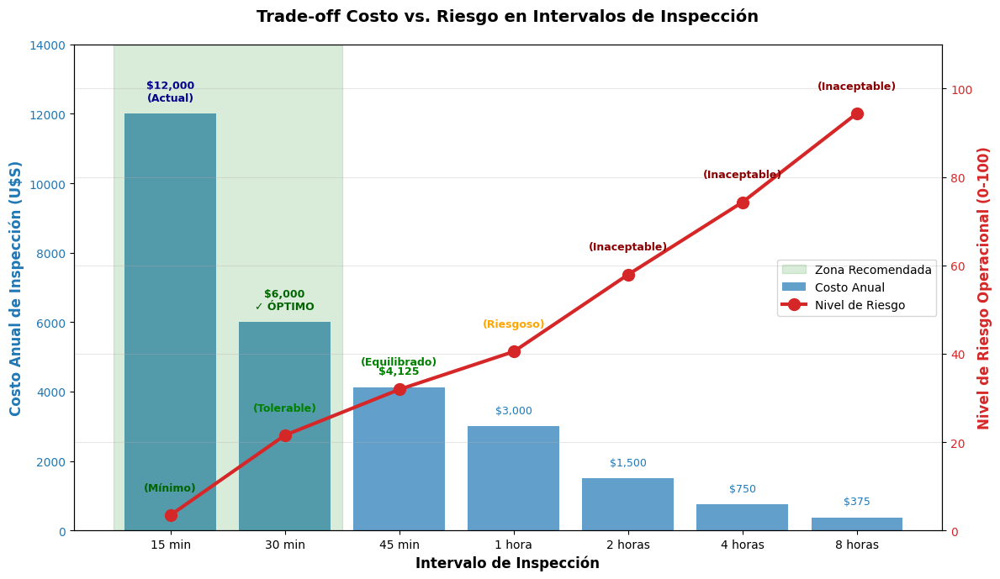

# CASO 1 - Componentes Eléctricos Defectuosos (./electricComponents.ipynb)

CPEL S.A. fabrica componentes electrónicos utilizados líneas de montaje de robótica industrial. Los componentes son tecnológicamente sofisticados y la calidad debe ser rigurosamente monitoreada. Para garantizar que se cumplen las especificaciones. Por supuesto, el control de calidad basado en inspección puede ser una actividad costosa y que consume mucho tiempo.  
En el proceso de inspección actual un componente de la línea de producción se selecciona al azar cada 15 minutos. Cada componente es inspeccionado y los defectos clasificados en Mayores y Menores, el costo de cada inspección es de U$S1,5. Los componentes con defectos Mayores, son los que afectan al rendimiento de los componentes y deben ser solucionados inmediatamente. Afortunadamente, los defectos Mayores son encontrados esporádicamente, porque generalmente son detectados y corregidos tempranamente en el proceso de producción. Los defectos Menores, tales como pequeñas imperfecciones en la forma, son aquellos que afectan la apariencia de un componente, pero no su funcionalidad. Monitorear los defectos Menores y garantizar que la tasa no aumente es de particular preocupación para la gerencia de producción y calidad.  
Nuestro objetivo es explorar la eficiencia del proceso de inspección actual y recomendar acciones a la gerencia para reducir los costos y la ocurrencia de los defectos Menores.

## DATASET

El dataset contiene registros de inspección de componentes eléctricos, con las siguientes columnas:

**Tabla 1: Descripción de las variables del dataset**
Variable | Descripción
---------|-----------------------
ID | Identificador único del componente inspeccionado
Hora | Hora de la inspección
Día 1 | Número de defectos Menores detectados en el primer día.
Día 2 | Número de defectos Menores detectados en el segundo día.
Día 3 | Número de defectos Menores detectados en el tercer día.
Día 4 | Número de defectos Menores detectados en el cuarto día.
Día 5 | Número de defectos Menores detectados en el quinto día.
Día 6 | Número de defectos Menores detectados en el sexto día.
Día 7 | Número de defectos Menores detectados en el séptimo día.
Día 8 | Número de defectos Menores detectados en el octavo día.
Día 9 | Número de defectos Menores detectados en el noveno día.
Día 10 | Número de defectos Menores detectados en el décimo día.

## ANÁLISIS

Luego de transformar el dataset, agregando una columna llamada "Defectos_menores", y pasando el Día de columna a índice, obtenemos 320 observaciones que reflejan las inspecciones realizadas, y la cantidad de defectos menores encontrados en cada una de ellas.
Como primer análisis, se observan un total de 3304 defectos y con una media de 10.32 por inspección. El valor mínimo registrado es 1 y el máximo es 18 defectos menores en una inspección. La hora con mas defectos encontrados es a las 15:00 horas, con un total de 118, y la hora con menos defectos es a las 11:00 horas, con un total de 80 defectos menores encontrados.

En la Figura 1 se observa la distribución de los defectos menores encontrados en las inspecciones. Se puede observar que la mayoría de las inspecciones tienen entre 7 y 14 defectos menores. La distribución parece ser aproximadamente normal, aunque con una ligera asimetría hacia la derecha.

En la Figura 2 se presenta un gráfico de barras que muestra la suma total de defectos menores encontrados por hora de inspección a lo largo de los 10 días. Se observa que no hay una tendencia clara en la cantidad de defectos menores encontrados a lo largo del día. Algunas horas muestran picos en la cantidad de defectos, pero no hay un patrón consistente que sugiera que ciertas horas del día son más propensas a defectos menores.

En la Figura 3 se presenta un diagrama de dispersión que muestra la relación entre la hora de inspección y el número de defectos menores encontrados. Tal como se sospechaba, no se observa una correlación entre la hora del día y la cantidad de defectos menores encontrados. Esto sugiere que la hora de inspección no tiene un impacto significativo en la ocurrencia de defectos menores.

## PROYECTO DE MEJORA

Para evaluar el impacto de diferentes niveles de inspección en la cantidad de defectos menores encontrados y los costos asociados, se simularon varios escenarios con diferentes frecuencias de inspección. Se consideraron niveles de inspección que van desde la actual (cada 15 minutos) hasta inspecciones cada 24 horas. Si bien el ahorro en costos es evidente al reducir la frecuencia de inspección, también se debe considerar el riesgo de que la cantidad de defectos menores aumente si las inspecciones son demasiado infrecuentes.

En la Figura 5 se muestra el trade-off entre el costo total de las inspecciones y el riesgo asociado con diferentes frecuencias de inspección. A medida que se reduce la frecuencia de inspección, el costo anual disminuye, pero el riesgo a un mayor tiempo de exposición a defectos mayores sin detección o picos de defectos menores aumenta considerablemente. Esto sugiere que hay un punto óptimo donde se puede minimizar el costo sin aumentar significativamente el riesgo.

Visto que los defectos menores no muestran una correlación significativa con la hora del día ni existe un patrón claro en su ocurrencia, se puede considerar la posibilidad de reducir la frecuencia de inspección sin comprometer la calidad del producto. Sin embargo, es crucial implementar un plan de monitoreo continuo para asegurar que la reducción en la frecuencia de inspección no conduzca a un aumento inaceptable en los defectos menores ni acciones tardías en la detección de defectos mayores.
Se recomienda el siguiente plan de implementación gradual para optimizar el proceso de inspección:
| Decisión | Intervalo | Ahorro anual | Riesgo | Recomendación |
|----------|-----------|--------------|--------|---------------|
| **CONSERVADORA** | 30 min | U$S 6,000 | Bajo | ✅ **IMPLEMENTAR** |
| **BALANCEADA** | 45 min | U$S 7,500 | Moderado | ⚠️ Evaluar post-piloto |
| **AGRESIVA** | 1 hora | U$S 9,000 | Alto | ❌ Requiere mitigación |
| **EXCESIVA** | 2+ horas | U$S 10,500+ | Muy alto | ❌ NO RECOMENDABLE |
