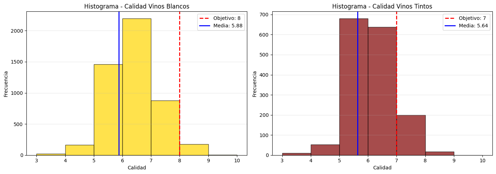
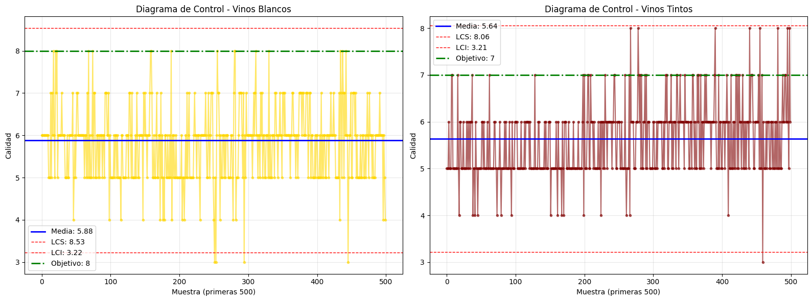
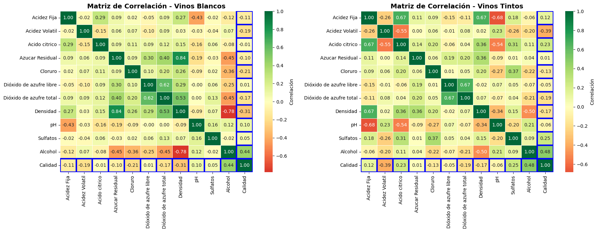
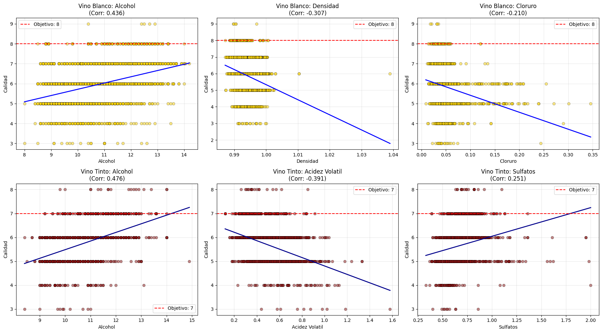
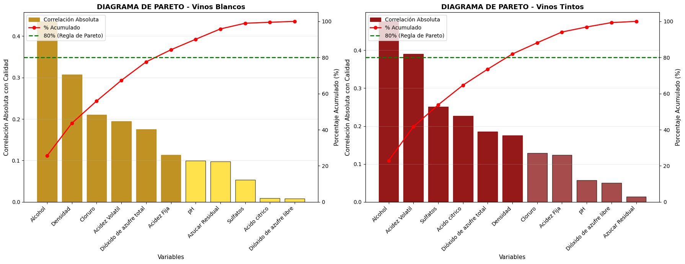
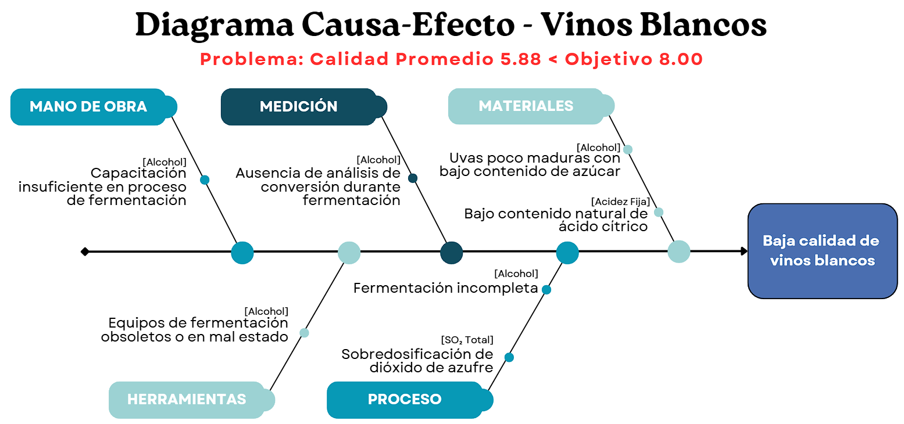
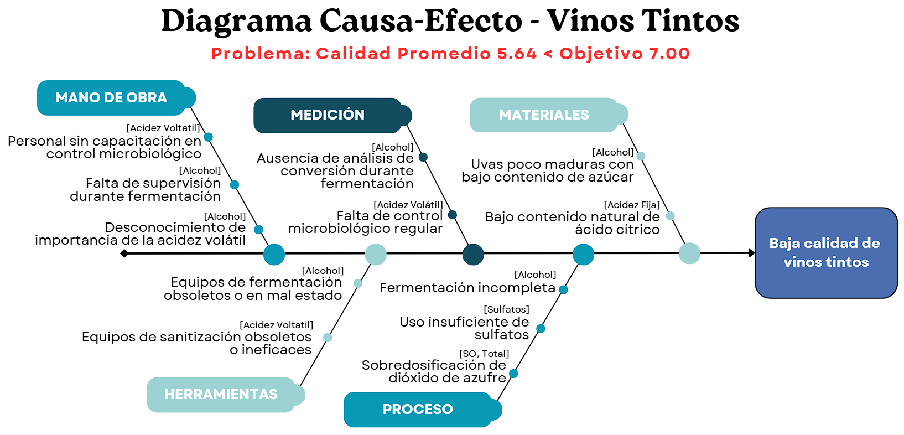

# CASO 1 - PRIMV S.A

PRIMV S.A es una empresa vitivinícola que produce vinos en Argentina y en China. En la Argentina tiene dos unidades productivas, una en la provincia de Mendoza, en la localidad Lujan de Cuyo y otra en la provincia de La Rioja, en el Valle de Aminga.  
El área de marketing tiene la sospecha de que las puntuaciones de calidad de los productos están decreciendo. El objetivo del área de marketing es lograr una puntuación de calidad alrededor de 8 (ocho) para los vinos blancos y 7 (siete) para los vinos tintos. Solicitan al área de calidad que analicen el proceso general de fabricación de vinos, informen lo observado, encuentren las posibles causas y que se debe corregir para lograr los objetivos especificados.  
Nuestro objetivo es analizar el proceso de fabricación de vinos mediante técnicas de control de calidad para:

- Identificar las posibles causas que afectan la calidad de los vinos
- Determinar los valores óptimos de las variables de proceso
- Proponer un proyecto de mejora para alcanzar los objetivos de marketing

## DATASET

El dataset contiene información tanto de vinos blancos como tintos, con las siguientes variables:

**Tabla 1: Descripción de las variables del dataset**
Variable | Descripción
---------|-----------------------
Acidez Fija | La mayoría de los ácidos del vino son fijos o no volátiles (no se evaporan fácilmente). Incluyen ácidos tartárico, málico y láctico. Aportan estructura y frescura al vino.
Acidez Volátil | Cantidad de ácido acético en el vino. En exceso indica deterioro bacteriano y produce sabor/olor a vinagre. Debe mantenerse bajo.
Ácido Cítrico | Se encuentra en pequeñas cantidades. Aporta 'frescura' y sabor cítrico al vino. Más común en vinos tintos jóvenes.
Azúcar Residual | Cantidad de azúcar que queda después de que se detiene la fermentación. Determina si el vino es seco, semiseco o dulce.
Cloruro | Cantidad de sal (cloruro de sodio) en el vino. Proviene del suelo, agua y materia prima. En exceso afecta negativamente el sabor.
Dióxido de Azufre Libre | Forma libre de SO₂ en equilibrio entre SO₂ molecular (gas disuelto) y ion bisulfito. Previene crecimiento microbiano y oxidación del vino.
Dióxido de Azufre Total | Cantidad total de formas libres y ligadas de SO₂. En bajas concentraciones es indetectable, pero sobre 50 ppm se nota en nariz y paladar.
Densidad | Masa por unidad de volumen. Relacionada con el contenido de azúcar y alcohol. Disminuye a medida que el azúcar se convierte en alcohol.
pH | Describe qué tan ácida o básica es una sustancia en escala de 0 (muy ácida) a 14 (muy básica). Afecta color, estabilidad y sabor del vino.
Sulfatos | Aditivo del vino (sulfato de potasio) que contribuye a niveles de SO₂. Actúa como antimicrobiano y antioxidante.
Alcohol | Porcentaje de contenido alcohólico del vino (% vol). Producto de la fermentación de azúcares por levaduras.
Calidad | Puntuación sensorial entre 0 y 10 asignada por evaluadores expertos.

## ANÁLISIS

El dataset de vinos blancos cuenta con 4898 observaciones, mientras que el de vinos tintos tiene 1599 observaciones. Cada observación representa un vino diferente con sus respectivas características fisicoquímicas y su puntuación de calidad asignada por expertos.  
En la Figura 1 se observa la distribución de calidad para ambos tipos de vino. Se puede notar que la mayoría de los vinos tienen una calidad entre 5 y 6, con pocos vinos alcanzando las calidades objetivo establecidas por marketing. El promedio de calidad para los vinos blancos es de 5.88 con una brecha de 2.12 respecto al objetivo de marketing (8). Para los vinos tintos, el promedio de calidad es de 5.64, con una brecha de 1.36 respecto al objetivo de marketing (7). El promedio de vinos blancos con calidad mayor o igual a 8 es del 3.67%, mientras que para los vinos tintos con calidad mayor o igual a 7 es del 13.57%.

En la Figura 2 se presenta un diagrama de control para la calidad de los vinos blancos. Se observa que hay varios puntos fuera de los límites de control, lo que indica que el proceso no está bajo control estadístico. También se visualiza la linea de media, que está por debajo del objetivo de marketing. Esto sugiere que hay variabilidad en el proceso de producción que debe ser investigada y corregida para mejorar la calidad del producto final.

La matriz de correlación en la Figura 3 muestra las relaciones entre las diferentes variables del dataset. Se observa que algunas variables tienen una correlación significativa con la calidad del vino, como el alcohol, la densidad y el cloruro en el caso de los vinos blancos, y alcohol, acidez volatil y sulfatos en el caso de los vinos tintos. Estas variables podrían ser factores clave que afectan la calidad del vino y deberían ser consideradas en el análisis para identificar posibles causas de la baja calidad y proponer mejoras en el proceso de producción.

En la Figura 4 se presentan gráficos de dispersión con líneas de tendencia para las variables que mostraron una mayor correlación con la calidad del vino. En el caso de los vinos blancos, se observa una tendencia positiva entre el alcohol y la calidad, mientras que la densidad muestra una tendencia negativa. Para los vinos tintos, el alcohol también muestra una tendencia positiva con la calidad, mientras que la acidez volátil presenta una tendencia negativa. Estos gráficos ayudan a visualizar cómo estas variables pueden influir en la calidad del vino y proporcionan información valiosa para identificar áreas de mejora en el proceso de producción.

A continuación, en la Figura 5 se muestra un diagrama de Pareto que identifica las causas potenciales que afectan la calidad del vino. Al enfocarse solo en estas causas principales, se logra reducir el costo y el esfuerzo necesarios para mejorar la calidad del vino, permitiendo a la empresa alcanzar los objetivos de marketing de manera más eficiente. En ambos tipos de vino, son 6 las variables que acumulan el 80% del impacto en la calidad, por lo que logramos reducir el análisis a estas variables clave.

En la Tabla 2 se resumen las diferencias clave entre los promedios de las variables seleccionadas para vinos blancos con calidad baja (menor 8) y alta (mayor o igual a 8). Se observa que el alcohol tiene una diferencia positiva significativa, el Dióxido de azufre total muestra una diferencia negativa considerable, la Acidez Fija también presenta una diferencia negativa, mientras que en Densidad, Cloruro y Acidez Volátil es casi imperceptible. Estos resultados sugieren que para mejorar la calidad de los vinos blancos, se debería considerar aumentar el contenido de alcohol y reducir el Dióxido de azufre total y la Acidez Fija en el proceso de producción. Mientras que las otras variables, a pesar de tener correlación con la calidad, no presentan diferencias significativas entre los grupos de calidad analizados.

**Tabla 2: Diferencias clave entre promedios de variables para vinos blancos de calidad baja y alta**
Variable | Promedio Calidad Bajo | Promedio Calidad Alto | Diferencia
---------|-----------------------|----------------------|----------------
Alcohol | 10.47 | 11.65 | +1.18
Densidad | 0.99 | 0.99 | 0.00
Cloruro | 0.05 | 0.04 | -0.01
Acidez Volátil | 0.28 | 0.28 | 0.00
Dióxido de azufre total | 138.84 | 125.88 | -12.95
Acidez Fija | 6.86 | 6.68 | -0.18

En la Tabla 3 se resumen las diferencias clave entre los promedios de las variables seleccionadas para vinos tintos con calidad baja (menor 7) y alta (mayor o igual a 7). Se observa que el alcohol tiene una diferencia positiva significativa, la Acidez Volátil muestra una diferencia negativa considerable, los Sulfatos y el Ácido cítrico presentan diferencias positivas notables, mientras que el Dióxido de azufre total tiene una diferencia negativa significativa. La Densidad no presenta una diferencia significativa entre los grupos de calidad analizados. Estos resultados sugieren que para mejorar la calidad de los vinos tintos, se debería considerar aumentar el contenido de alcohol, Sulfatos y Ácido cítrico, mientras que se debería reducir la Acidez Volátil y el Dióxido de azufre total en el proceso de producción.

**Tabla 3: Diferencias clave entre promedios de variables para vinos tintos de calidad baja y alta**
Variable | Promedio Calidad Bajo | Promedio Calidad Alto | Diferencia
---------|-----------------------|----------------------|----------------
Alcohol | 10.25 | 11.52 | +1.27
Acidez Volátil | 0.55 | 0.41 | -0.14
Sulfatos | 0.64 | 0.74 | +0.10
Acido cítrico | 0.25 | 0.38 | +0.12
Dióxido de azufre total | 48.29 | 34.89 | -13.40
Densidad | 1.00 | 1.00 | 0.00

En la Figura 6 se presenta el diagrama de Ishikawa para los vinos blancos, que identifica las posibles causas que afectan la calidad del producto final. Cada categoría contiene causas específicas que pueden contribuir a la baja calidad del vino, como uvas insuficientemente maduras, fermentación incompleta, equipos obsoletos, falta de capacitación del personal o ausencia de análisis durante la fermentación.

En la Figura 7 se presenta el diagrama de Ishikawa para los vinos tintos, que identifica las posibles causas que afectan la calidad del producto final. Cada categoría contiene causas específicas que pueden contribuir a la baja calidad del vino, como uvas insuficientemente maduras, bajo contenido natural de ácido cítrico, fermentación incompleta, equipos obsoletos, falta de capacitación del personal o ausencia de análisis durante la fermentación.

## PROYECTO DE MEJORA

Basándonos en el análisis realizado, se propone el siguiente plan de acción para mejorar la calidad de los vinos producidos por PRIMV S.A:  
**Etapa 1** - Atacar las variables con mayor impacto en la calidad:

- Aumentar el contenido de alcohol mediante la selección de uvas más maduras y optimización del proceso de fermentación.
- Reducir el Dióxido de azufre total ajustando las dosis de SO₂ durante el proceso de vinificación.
- Disminuir la Acidez Fija en vinos blancos mediante técnicas de ajuste de acidez.
- Reducir la Acidez Volátil en vinos tintos mediante mejoras en la higiene y control microbiológico durante la fermentación.
- Incrementar los niveles de Sulfatos y Ácido cítrico en vinos tintos mediante la adición controlada de estos compuestos.
- Implementar un programa de capacitación para el personal en control de calidad y buenas prácticas de fabricación.

**Etapa 2** - Monitoreo y control continuo:

- Establecer un sistema de monitoreo continuo de las variables críticas identificadas.

**Etapa 3** - Evaluación y ajuste:

- Ajustar el plan de acción según sea necesario.
- En caso de ser necesario, agregar la siguiente variable con mas relevancia según el análisis de Pareto:
  - PH en vinos blancos
  - Cloruros en vinos tintos
